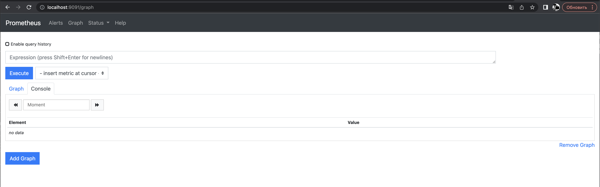
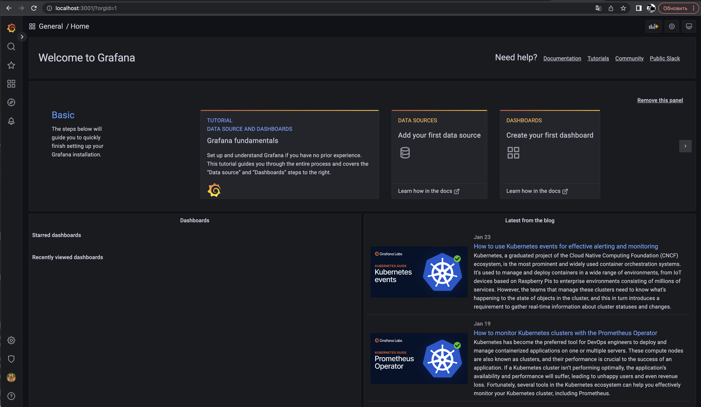
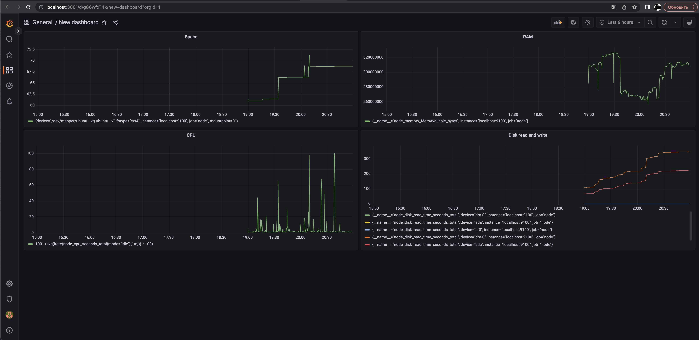
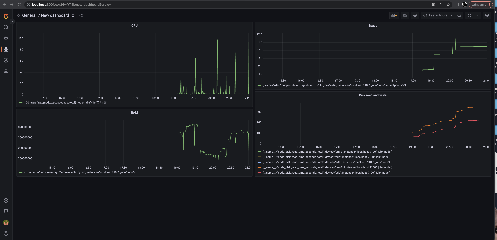
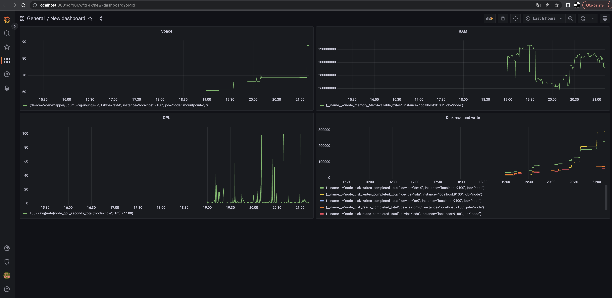

# Part 7. Prometheus и Grafana

* Веб интерфейс Prometheus

* Веб интерфейс Grafana

* Данные до

* Запускаем стресс тест через stress -c 2 -i 1 -m 1 --vm-bytes 32M -t 60s
* Данные после

* Запускаем скрипт из задания 2

