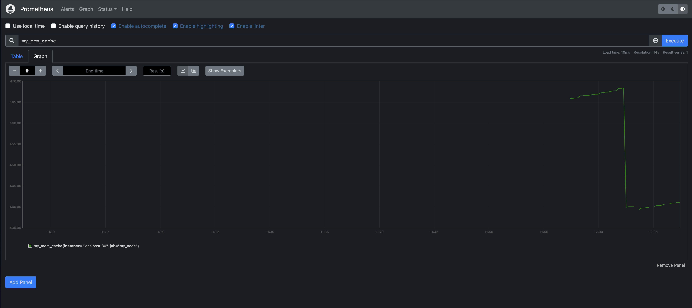

# Part 9. Дополнительно. Свой *node_exporter*

* Запускаем мейн скрипт для установки конфига прометеуса поднятия nginx сервера и перезапуска info.sh  скрипта
* Проверям страницу которую отдает nginx сервер

* Настраиваем прометеус и смотрим что появился новый источник данных

* Смотрим данные

